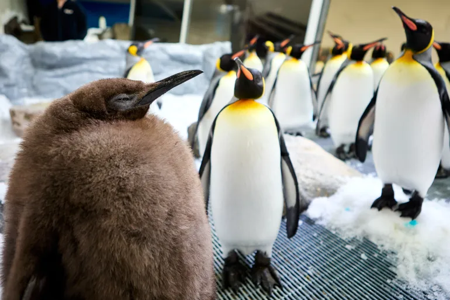

```{r setup, include=FALSE}
# install.packages('knitr')
library(knitr)
opts_chunk$set(echo = T,  message = F)
# if you want to generate a PDF document you will need to install tex. Run the following commands:
# install.packages('tinytex')
# tinytex::install_tinytex()
```

# R Markdown

This is an R Markdown document. Markdown is a simple formatting syntax for authoring HTML, PDF, and MS Word documents. Most importantly, we can embed R code into our text! For more details on using R Markdown see <http://rmarkdown.rstudio.com>.

When you click the **Knit** button a document will be generated that includes both content as well as the output of any embedded R code chunks within the document.

# Load packages

In this first chunk, we load some useful packages. If you don't have the packages installed already, you will get an error message. To install packages, use the `install.packages()` function.

```{r packages}
# install.packages('tidyverse')
library(tidyverse)
# install.packages('here')
library(here)
```

# Load data

Ok now we're set up, let's load in some data about penguins. The dataset contains observations about penguins collected at the Palmer Station in Antarctica by @gorman2014.

```{r}
penguins_v1 <- read_csv(here('data','raw','penguins_v1.csv'))
```

Among the variables in `penguins_v1` are:

`species`: a penguin’s species (Adelie, Chinstrap, or Gentoo).

`flipper_length_mm`: length of a penguin’s flipper, in millimeters.

`body_mass_g`: body mass of a penguin, in grams.

# Make a plot

Let's make a plot now to examine the relationship between flipper length and body mass.

```{r flip-bod-plot, fig.cap="Relationship between flipper length and body mass."}
ggplot(
  data = penguins_v1,
  mapping = aes(x = flipper_length_mm, y = body_mass_g)
) +
  geom_point(aes(color = species, shape = species)) +
  geom_smooth(method = "lm") +
  labs(
    title = "Body mass and flipper length",
    subtitle = "Dimensions for Adelie, Chinstrap, and Gentoo Penguins",
    x = "Flipper length (mm)", y = "Body mass (g)",
    color = "Species", shape = "Species"
  ) +
  scale_color_viridis_d() +
  theme_minimal()
```

# Updating a plot

But wait, it looks like we're getting some warning messsages — let's check out the source of those.

```{r}
penguins_v1 %>% 
  filter(is.na(flipper_length_mm))
```

It looks like penguin 94 is missing several measurements. You contact the scientist who supplied the data and they find the missing information in a notebook and send you an updated data file `penguins_v2.csv`.

Let's load in the new data.

```{r}
penguins_v2 <- read_csv(here('data','raw','penguins_v2.csv'))
```

Let's check if the data for penguin 94 has been updated...

```{r}
penguins_v2 %>% 
  filter(id == 94)
```

It has — great!

Let's try and make the plot again...

```{r flip-bod-plot-corrected, fig.cap="Relationship between flipper length and body mass with missing data corrected."}
ggplot(
  data = penguins_v2,
  mapping = aes(x = flipper_length_mm, y = body_mass_g)
) +
  geom_point(aes(color = species, shape = species)) +
  geom_smooth(method = "lm") +
  labs(
    title = "Body mass and flipper length",
    subtitle = "Dimensions for Adelie, Chinstrap, and Gentoo Penguins",
    x = "Flipper length (mm)", y = "Body mass (g)",
    color = "Species", shape = "Species"
  ) +
  scale_color_viridis_d() +
  theme_minimal()
```

No warnings this time!

# Some new data comes in

Ok let's look at a couple of other scenarios where we might want to update our analyses. The original penguin data was collected in 2007 and 2008. In 2009, your client tells you that some new penguin data come in and wants you to updated the analyses. Fortunately, we don't have to rewrite everything from scratch because we have a reproducible analysis script!

So let's load in the new data `penguins_v3`.

```{r}
penguins_v3 <- read_csv(here('data','raw','penguins_v3.csv'))
```

We can make a table to see how many penguins we have each year...

```{r penguin-table}
penguins_v3 %>% 
  count(year) %>%
  kable(caption = "Number of penguins by year")
```

Great! Now we have an additional 120 penguins for the year 2009.

Let's make our plot again with the new data...

```{r flip-bod-plot-more-penguins, fig.cap="Relationship between flipper length and body mass with new data."}
ggplot(
  data = penguins_v3,
  mapping = aes(x = flipper_length_mm, y = body_mass_g)
) +
  geom_point(aes(color = species, shape = species)) +
  geom_smooth(method = "lm") +
  labs(
    title = "Body mass and flipper length",
    subtitle = "Dimensions for Adelie, Chinstrap, and Gentoo Penguins",
    x = "Flipper length (mm)", y = "Body mass (g)",
    color = "Species", shape = "Species"
  ) +
  scale_color_viridis_d() +
  theme_minimal()
```

Excellent! In R Markdown, we don't have to keep rewriting the analysis from scratch (which is inefficient and error prone). Instead we can just reuse our old code and update specific aspects that we want to change.

# Another request comes in...

Ok let's look at one more scenario. You present your findings to your client. They are very impressed, but they have a question — does the relationship between flipper length and body mass vary between the three different islands that the data were collected from?

Fortunately, all we need to do is add a single line of code to our existing plot: `facet_wrap(. ~island)` to stratify the results by island.

```{r flip-bod-plot-by-island, fig.cap="Relationship between flipper length and body mass stratified by island."}

ggplot(
  data = penguins_v3,
  mapping = aes(x = flipper_length_mm, y = body_mass_g)
) +
  facet_wrap(. ~island) +
  geom_point(aes(color = species, shape = species)) +
  geom_smooth(method = "lm") +
  labs(
    title = "Body mass and flipper length",
    subtitle = "Dimensions for Adelie, Chinstrap, and Gentoo Penguins",
    x = "Flipper length (mm)", y = "Body mass (g)",
    color = "Species", shape = "Species"
  ) +
  scale_color_viridis_d() +
  theme_minimal()
```

Great! You've learned how to update your analyses and generate a reproducible research report!

Let's look at a few other nifty features of R Markdown...

# Citations

In our research reports, we often want to add citations. We can do this in R Markdown too!

For example, we can add a citation to Hadley Wickham's paper about tidy data [@wickham2014].

There's also a helpful plugin for R Studio called `citr`. This allows you to search your Zotero library for references from within R Studio, which saves a lot of time.

```{r}
# devtools::install_github("crsh/citr")
```

# Cross-references

We can also add cross-references to tables and figures that automatically update their numbering if we change the order. For example, above we initially created Figure \@ref(fig:flip-bod-plot). We then corrected the missing data problem (Figure \@ref(fig:flip-bod-plot-corrected)), and added in some new data (Figure \@ref(fig:flip-bod-plot-more-penguins)). Finally, we made a plot that stratified the results by island (Figure \@ref(fig:flip-bod-plot-by-island)).

We can also cross-reference to tables, for example Table \@ref(tab:penguin-table).

# Inline code

As well as code chunks, we can embed short pieces of code directly into our text. This is helpful when we want to ensure that numbers embedded in text are reproducible. For example, when the sample size of `penguins_v1` is `r nrow(penguins_v1)` and the sample size of `penguins_v3` is `r nrow(penguins_v3)`. If you take a look at the source code of this document, you can see that those numbers were generated by code.

# Setting the seed

How do we ensure reproducibility when our analyses involve randomness? We can use a function called `set.seed()` to ensure that such computations are repeatable, as shown below.

```{r}
# this will generate different outputs
sample(1:10, 5) 
sample(1:10, 5)

# to get the same output, we need to set the seed each time
set.seed(42)
sample(1:10, 5) 
set.seed(42)
sample(1:10, 5)
```

# References